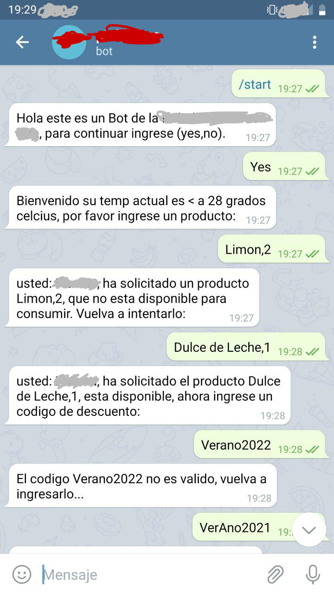
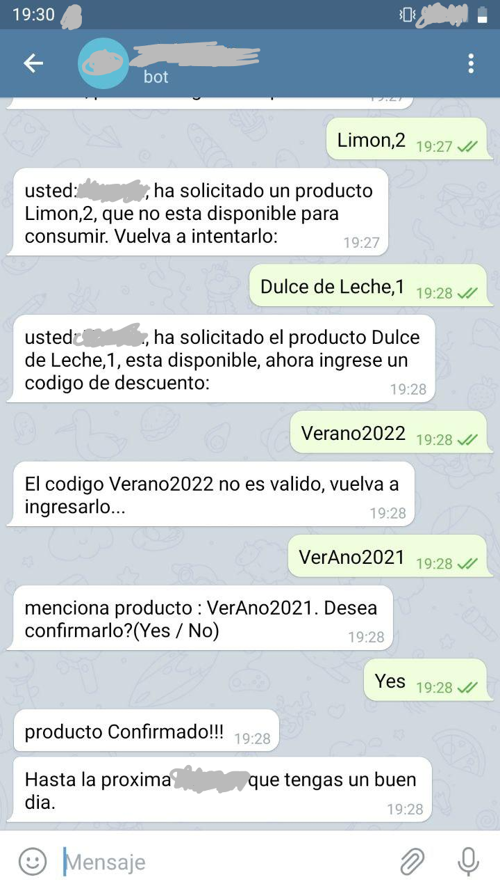

Caso de uso de estados por medio de Bot
========================

# Roadmap

- [x] coding
- [x] refactor
- [x] Bot real
- [x] test
- [x] env aislado
- [x] separación de logica
- [x] versionar publico

# Uso

Instalar las dependencias:

```
pip install deploy-requirements.txt

python run-dev.py

```

```
Para la configurcion es necario que dentro del folder ***config*** exista un archivo development.json que contiene la información del usa la app

{
    "app":{
        "port":5000, => para este caso el puerto puede ser cualquiera ya que la versión web aqui no la esta completa y corre alone
        "user":"userboot",
        "token":"tokenbot",
        "url": "url en caso de webhook" => igualmente aqui no hace falta puede estar blanco por ahora,
        "apigeo":"token clima",
        "lat":"coordenadas lat",
        "lon":"coordenadas long"
    }

```

De preferencia se realizo todo por medio de Pipenv. El ejemplo de arriba es para aquellos que tienen pip sobre container o Desktop. Caso contrario usen "pipenv install".

# Ejemplo






# Documentación extra


